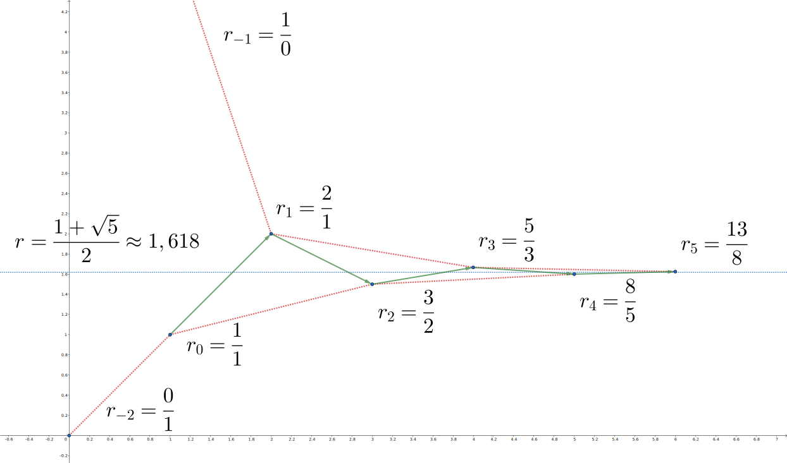
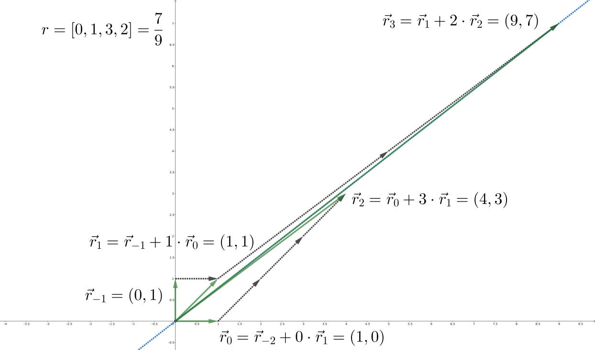

## Continued Fractions

### Introduction

A continued fraction represents a real number as a specific convergent sequence of rational numbers. They are useful in competitive programming because they are easy to compute and can efficiently find the best possible rational approximation of a real number, given a maximum denominator value. Continued fractions are closely related to the Euclidean algorithm, making them useful in various number-theoretical problems.

### Continued Fraction Representation

**Definition:**
Let $ a_0, a_1, \dots, a_k \in \mathbb{Z} $ and $ a_1, a_2, \dots, a_k \geq 1 $. The expression:
$ r = a_0 + \frac{1}{a_1 + \frac{1}{a_2 + \frac{1}{\dots + \frac{1}{a_k}}}} $
is called the continued fraction representation of the rational number $ r $ and is denoted as $ r = [a_0; a_1, a_2, \dots, a_k] $.

**Example:**
For $ r = \frac{5}{3} $, there are two continued fraction representations:
$ r = [1; 1, 1, 1] = 1 + \frac{1}{1 + \frac{1}{1 + \frac{1}{1}}} $
$ r = [1; 1, 2] = 1 + \frac{1}{1 + \frac{1}{2}} $

It can be shown that any rational number can be represented as a continued fraction in exactly two ways:
$ r = [a_0; a_1, \dots, a_k, 1] = [a_0; a_1, \dots, a_k+1] $

### Continued Fraction for Irrational Numbers

**Definition:**
Let $ a*0, a_1, a_2, \dots $ be an integer sequence with $ a_1, a_2, \dots \geq 1 $. Let $ r_k = [a_0; a_1, \dots, a_k] $. Then:
$ r = a_0 + \frac{1}{a_1 + \frac{1}{a_2 + \dots}} = \lim*{k \to \infty} r_k $
is called the continued fraction representation of the irrational number $ r $ and is denoted as $ r = [a_0; a_1, a_2, \dots] $.

**Properties:**

- For $ r = [a_0; a_1, \dots] $ and an integer $ k $, it holds that $ r + k = [a_0 + k; a_1, \dots] $.
- If $ a_0 > 0 $, then $ \frac{1}{r} = [0; a_0, a_1, \dots] $.
- If $ a_0 = 0 $, then $ \frac{1}{r} = [a_1; a_2, \dots] $.

### Convergents and Complete Quotients

**Definition:**
The rational numbers $ r_0, r_1, r_2, \dots $ are called the convergents of $ r $. Specifically, $ r_k = [a_0; a_1, \dots, a_k] = \frac{p_k}{q_k} $ is the $ k $-th convergent of $ r $.

**Example:**
Consider $ r = [1; 1, 1, 1, \dots] $. It can be shown that:
$ r*k = \frac{F*{k+2}}{F*{k+1}} $
where $ F_k $ is the Fibonacci sequence defined as $ F_0 = 0 $, $ F_1 = 1 $, and $ F_k = F*{k-1} + F*{k-2} $. Using Binet's formula, we have:
$ r_k = \frac{\phi^{k+2} - \psi^{k+2}}{\phi^{k+1} - \psi^{k+1}} $
where $ \phi = \frac{1 + \sqrt{5}}{2} $ is the golden ratio, and $ \psi = \frac{1 - \sqrt{5}}{2} = -\frac{1}{\phi} $. Thus:
$ r = 1 + \frac{1}{1 + \frac{1}{1 + \dots}} = \lim*{k \to \infty} r_k = \phi = \frac{1 + \sqrt{5}}{2} $

### Semi-convergents and Complete Quotients

**Definition:**
For $ r*k = [a_0; a_1, \dots, a*{k-1}, a*k] $, the numbers $ [a_0; a_1, \dots, a*{k-1}, t] $ for $ 1 \leq t \leq a_k $ are called semi-convergents.

**Definition:**
Complete quotients are defined as $ s*k = [a_k; a*{k+1}, a\_{k+2}, \dots] $. The $ k $-th complete quotient of $ r $ is $ s_k $.

### Continued Fraction Construction and Euclidean Algorithm

**Implementation:**
To compute the continued fraction representation of $ r = \frac{p}{q} $, follow these steps, inspired by the Euclidean algorithm:

1. Initialize a list to store the coefficients.
2. While $ q $ is not zero:
   - Compute the quotient $ a $ as the integer division of $ p $ by $ q $.
   - Append $ a $ to the list.
   - Update $ p $ and $ q $ using the Euclidean algorithm (swap $ q $ and the remainder of $ p $ divided by $ q $).
3. Return the list of coefficients.

**Pseudocode:**

```pseudocode
function continued_fraction(p, q):
    a = []
    while q != 0:
        a_i = p // q
        append a_i to a
        (p, q) = (q, p % q)
    return a
```

This pseudocode outlines the steps to compute the continued fraction representation of a rational number $ \frac{p}{q} $.

## Key Results

To motivate further study of continued fractions, here are some key facts:

### Recurrence

For the convergents $ r_k = \frac{p_k}{q_k} $, the following recurrence relation allows for fast computation:

$ \frac{p*k}{q_k} = \frac{a_k p*{k-1} + p*{k-2}}{a_k q*{k-1} + q\_{k-2}} $

with initial values:

$ \frac{p*{-1}}{q*{-1}} = \frac{1}{0}, \quad \frac{p*{-2}}{q*{-2}} = \frac{0}{1} $

### Deviations

The deviation of $ r_k = \frac{p_k}{q_k} $ from $ r $ can be estimated as:

$ \left| \frac{p*k}{q_k} - r \right| \leq \frac{1}{q_k q*{k+1}} \leq \frac{1}{q_k^2} $

Multiplying both sides by $ q_k $, we get an alternative estimation:

$ |p*k - q_k r| \leq \frac{1}{q*{k+1}} $

From the recurrence relation, it follows that $ q_k $ grows at least as fast as the Fibonacci numbers.

In the visualization below, you can see how convergents $ r_k $ approach $ r = \frac{1 + \sqrt{5}}{2} $:



$ r = \frac{1 + \sqrt{5}}{2} $ is depicted by the blue dotted line. Odd convergents approach from above, and even convergents approach from below.

### Lattice Hulls

Consider the convex hulls of points above and below the line $ y = rx $.

- Odd convergents $ (q_k; p_k) $ are the vertices of the upper hull.
- Even convergents $ (q_k; p_k) $ are the vertices of the bottom hull.

All integer vertices on the hulls are given by:

$ \frac{p}{q} = \frac{t p*{k-1} + p*{k-2}}{t q*{k-1} + q*{k-2}} $

for integer $ 0 \leq t \leq a_k $. In other words, the set of lattice points on the hulls corresponds to the set of semi-convergents.

The following visualization shows the convergents and semi-convergents (intermediate gray points) of $ r = \frac{9}{7} $:



### Best Approximations

Let $ \frac{p}{q} $ be the fraction that minimizes $ \left| r - \frac{p}{q} \right| $ subject to $ q \leq x $ for some $ x $.

Then $ \frac{p}{q} $ is a semi-convergent of $ r $.

This fact allows finding the best rational approximations of $ r $ by checking its semi-convergents.

## Convergents

Let's take a closer look at the convergents that were defined earlier. For $ r = [a_0, a_1, a_2, \dots] $, its convergents are:

$
\begin{gather}
r_0 = [a_0], \\
r_1 = [a_0, a_1], \\
\vdots \\
r_k = [a_0, a_1, \dots, a_k].
\end{gather}
$

Convergents are the core concept of continued fractions, so it is important to study their properties.

For the number $ r $, its $ k $-th convergent $ r_k = \frac{p_k}{q_k} $ can be computed as:

$ r*k = \frac{P_k(a_0, a_1, \dots, a_k)}{P*{k-1}(a*1, \dots, a_k)} = \frac{a_k p*{k-1} + p*{k-2}}{a_k q*{k-1} + q\_{k-2}}, $

where $ P_k(a_0, \dots, a_k) $ is the continuant, a multivariate polynomial defined as:

$
P_k(x_0, x_1, \dots, x_k) = \det \begin{bmatrix}
x_k & 1 & 0 & \dots & 0 \\
-1 & x_{k-1} & 1 & \dots & 0 \\
0 & -1 & x_2 & \dots & \vdots \\
\vdots & \vdots & \dots & \ddots & 1 \\
0 & 0 & \dots & -1 & x_0
\end{bmatrix}.
$

Thus, $ r*k $ is a weighted mediant of $ r*{k-1} $ and $ r\_{k-2} $.

For consistency, two additional convergents $ r*{-1} = \frac{1}{0} $ and $ r*{-2} = \frac{0}{1} $ are defined.

### Detailed Explanation

The numerator and the denominator of $ r_k $ can be seen as multivariate polynomials of $ a_0, a_1, \dots, a_k $:

$ r_k = \frac{P_k(a_0, a_1, \dots, a_k)}{Q_k(a_0, a_1, \dots, a_k)}. $

From the definition of convergents,

$ r*k = a_0 + \frac{1}{[a_1; a_2, \dots, a_k]} = a_0 + \frac{Q*{k-1}(a*1, \dots, a_k)}{P*{k-1}(a*1, \dots, a_k)} = \frac{a_0 P*{k-1}(a*1, \dots, a_k) + Q*{k-1}(a*1, \dots, a_k)}{P*{k-1}(a_1, \dots, a_k)}. $

From this follows $ Q*k(a_0, \dots, a_k) = P*{k-1}(a_1, \dots, a_k) $. This yields the relation:

$ P*k(a_0, \dots, a_k) = a_0 P*{k-1}(a*1, \dots, a_k) + P*{k-2}(a_2, \dots, a_k). $

Initially,

$ r_0 = \frac{a_0}{1}, \quad r_1 = \frac{a_0 a_1 + 1}{a_1}, $

thus

$
\begin{aligned}
P_0(a_0) &= a_0, \\
P_1(a_0, a_1) &= a_0 a_1 + 1.
\end{aligned}
$

For consistency, it is convenient to define $ P*{-1} = 1 $ and $ P*{-2} = 0 $ and formally say that $ r*{-1} = \frac{1}{0} $ and $ r*{-2} = \frac{0}{1} $.

From numerical analysis, it is known that the determinant of an arbitrary tridiagonal matrix

$
T_k = \det \begin{bmatrix}
a_0 & b_0 & 0 & \dots & 0 \\
c_0 & a_1 & b_1 & \dots & 0 \\
0 & c_1 & a_2 & \dots & \vdots \\
\vdots & \vdots & \dots & \ddots & c_{k-1} \\
0 & 0 & \dots & b_{k-1} & a_k
\end{bmatrix}
$

can be computed recursively as $ T*k = a_k T*{k-1} - b*{k-1} c*{k-1} T\_{k-2} $. Comparing it to $ P_k $, we get a direct expression:

$
P_k = \det \begin{bmatrix}
x_k & 1 & 0 & \dots & 0 \\
-1 & x_{k-1} & 1 & \dots & 0 \\
0 & -1 & x_2 & \dots & \vdots \\
\vdots & \vdots & \dots & \ddots & 1 \\
0 & 0 & \dots & -1 & x_0
\end{bmatrix}.
$

This polynomial is also known as the continuant due to its close relation with continued fractions. The continuant won't change if the sequence on the main diagonal is reversed. This yields an alternative formula to compute it:

$ P*k(a_0, \dots, a_k) = a_k P*{k-1}(a*0, \dots, a*{k-1}) + P*{k-2}(a_0, \dots, a*{k-2}). $

### Pseudocode

To compute the convergents as a pair of sequences $ p*{-2}, p*{-1}, p*0, p_1, \dots, p_k $ and $ q*{-2}, q\_{-1}, q_0, q_1, \dots, q_k $:

```
def convergents(a):
    p = [0, 1]
    q = [1, 0]
    for ai in a:
        p.append(ai * p[-1] + p[-2])
        q.append(ai * q[-1] + q[-2])
    return p, q
```

## Trees of Continued Fractions

### Stern-Brocot Tree

The Stern-Brocot tree organizes all positive rational numbers into a binary search tree.

- Each node represents a rational number.
- The left child of a node `[a; b]` is `[a; b-1]`, and the right child is `[a+1; b]`.
- The tree starts with `0/1` on the left and `1/0` on the right.
- Mediant operation: For nodes `[a/b]` and `[c/d]`, the mediant `[a+c/b+d]` is the parent.

### Indexing

- Each rational number `[a/b]` in the tree is indexed in binary, reflecting its position.
- Example: `[2/5 = [0; 2, 2]]` has index `1100₂`.

### Comparison of Continued Fractions

For continued fractions `[a₀; a₁, ..., aₖ]` and `[b₀; b₁, ..., bₘ]`:

- Compare each corresponding element: If `aᵢ < bᵢ`, then `[a₀; a₁, ..., aₖ] < [b₀; b₁, ..., bₘ]`.
- Use lexicographical comparison: `(a₀, -a₁, a₂, -a₃, ...)`.

#### Pseudocode

```
function less(a, b):
    // Compare two continued fractions a and b
    a' = modify(a)  // Adjust a for comparison
    b' = modify(b)  // Adjust b for comparison
    return a' < b'

function expand(a):
    // Expand the continued fraction a
    if a is not empty:
        a[-1] -= 1
        a.append(1)
    return a

function pm_eps(a):
    // Generate two approximations of a, a-eps and a+eps
    b = expand(a.copy())
    a.append(infinity)
    b.append(infinity)
    return (a, b) if less(a, b) else (b, a)
```

### Best Inner Point

Find the rational number `(p/q)` such that `(q, p)` is lexicographically smallest and lies between `(p₀/q₀)` and `(p₁/q₁)`.

#### Solution

- Find the Least Common Ancestor (LCA) in the Stern-Brocot tree of `(p₀/q₀)` and `(p₁/q₁)`.
- For irrational numbers, the LCA can be determined using their continued fraction representations.

#### Pseudocode

```
function middle(p₀, q₀, p₁, q₁):
    a₀ = pm_eps(fraction(p₀, q₀))[1]
    a₁ = pm_eps(fraction(p₁, q₁))[0]
    a = []
    for i in range(min(length(a₀), length(a₁))):
        a.append(min(a₀[i], a₁[i]))
        if a₀[i] ≠ a₁[i]:
            break
    a[-1] += 1
    (p, q) = convergents(a)
    return p[-1], q[-1]
```

## Calkin-Wilf Tree

The Calkin-Wilf tree organizes rational numbers into a binary tree with the following properties:

- **Structure**:
  - Root node: $\frac{1}{1}$.
  - Children of a node $\frac{p}{q}$ are $\frac{p}{p+q}$ (left) and $\frac{p+q}{q}$ (right).
- **Parent-Child Relationships**:

  - Parent of $\frac{p}{q}$:
    - If $p > q$: $\frac{p-q}{q}$.
    - Otherwise: $\frac{p}{q-p}$ (if $p \neq q$) or $\frac{p}{q-p}$ (if $p = q$).

- **Connection with Continued Fractions**:
  - Recurrence: $s_{k+1} = \frac{q}{p \mod q}$, where $s_k = \frac{p}{q}$.
  - Parent relationship in terms of continued fractions:
    - If $a_0 > 0$: Parent is $[a_0 - 1; a_1, \dots, a_k]$.
    - If $a_0 = 0$ and $a_1 > 1$: Parent is $[0; a_1 - 1, a_2, \dots, a_k]$.
    - If $a_0 = 0$ and $a_1 = 1$: Parent is $[a_2; a_3, \dots, a_k]$.
- **Children**:

  - Children of $[a_0; a_1, \dots, a_k]$:
    - Left child: $[a_0+1; a_1, \dots, a_k]$.
    - Right child: $[0, 1, a_0, a_1, \dots, a_k]$ (if $a_0 > 0$) or $[0, a_1+1, a_2, \dots, a_k]$ (if $a_0 = 0$).

- **Indexing**:
  - Vertices enumerated in breadth-first order:
    - Root at index 1.
    - Children of vertex $v$ at indices $2v$ and $2v+1$.
  - Ordering differs from Stern-Brocot due to bit-reversal permutation.

### Pseudocode Example

```
function parent(p, q):
    if p > q:
        return [p - q, q]
    else if p == q:
        return [p, 0]
    else:
        return [p, q - p]

function left_child(p, q):
    return [p, p + q]

function right_child(p, q):
    return [p + q, q]

function level_order_index(v):
    // Breadth-first search index
    return v
```

### Example usage:

- **Parent Calculation**: Calculate the parent of $\frac{3}{5}$:

  ```
  Input: 3, 5
  Output: [2, 5]
  ```

- **Left Child Calculation**: Calculate the left child of $\frac{2}{5}$:

  ```
  Input: 2, 5
  Output: [2, 7]
  ```

- **Right Child Calculation**: Calculate the right child of $\frac{2}{5}$:

  ```
  Input: 2, 5
  Output: [7, 5]
  ```

- **Index in Calkin-Wilf Tree**: Determine the index of a rational number in the Calkin-Wilf tree, given its level-order position:
  ```
  Input: 5
  Output: 5
  ```

## Convergence in Continued Fractions

For a number $ r $ and its $ k $-th convergent $ r_k = \frac{p_k}{q_k} $, the following formulas hold:

1. The $ k $-th convergent is given by:

   $
   r_k = a_0 + \sum_{i=1}^k \frac{(-1)^{i-1}}{q_i q_{i-1}}
   $

2. Specifically,

   $
   r_k - r_{k-1} = \frac{(-1)^{k-1}}{q_k q_{k-1}}
   $

   and

   $
   p_k q_{k-1} - p_{k-1} q_k = (-1)^{k-1}
   $

3. Therefore,
   $
   \left| r - \frac{p_k}{q_k} \right| \leq \frac{1}{q_{k+1} q_k} \leq \frac{1}{q_k^2}
   $

### Detailed Explanation

To estimate $ |r - r_k| $:

- The difference between adjacent convergents is:

  $
  \frac{p_k}{q_k} - \frac{p_{k-1}}{q_{k-1}} = \frac{p_k q_{k-1} - p_{k-1} q_k}{q_k q_{k-1}}
  $

- Using the recurrence relations for $ p_k $ and $ q_k $:

  $
  p_k q_{k-1} - p_{k-1} q_k = p_{k-2} q_{k-1} - p_{k-1} q_{k-2}
  $

- This gives:

  $
  r_k - r_{k-1} = \frac{(-1)^{k-1}}{q_k q_{k-1}}
  $

- Thus,

  $
  r_k = a_0 + \sum_{i=1}^k \frac{(-1)^{i-1}}{q_i q_{i-1}}
  $

- As $ k \to \infty $:

  $
  r = \lim_{k \to \infty} r_k = a_0 + \sum_{i=1}^\infty \frac{(-1)^{i-1}}{q_i q_{i-1}}
  $

- The residual series $ r - r*k $ has the same sign as $ (-1)^k $ due to the decreasing rate of $ q_i q*{i-1} $.

- Even-indexed $ r_k $ approach $ r $ from below, while odd-indexed $ r_k $ approach it from above.

### Extended Euclidean

Given $ A, B, C \in \mathbb{Z} $, find $ x, y \in \mathbb{Z} $ such that $ Ax + By = C $.

- Using continued fractions:

  $
  \frac{A}{B} = [a_0; a_1, \dots, a_k]
  $

- From earlier, substituting $ p_k $ and $ q_k $ with $ A $ and $ B $:

  $
  A q_{k-1} - B p_{k-1} = (-1)^{k-1} g
  $

  where $ g = \gcd(A, B) $.

- If $ C $ is divisible by $ g $:

  $
  x = (-1)^{k-1} \frac{C}{g} q_{k-1}, \quad y = (-1)^k \frac{C}{g} p_{k-1}
  $

### Pseudocode

```python
# Find (x, y) such that Ax + By = C
# Assumes that such (x, y) exists
def dio(A, B, C):
    p, q = convergents(fraction(A, B))
    g = gcd(A, B)
    C //= g  # divide C by gcd(A, B)
    k = len(p) - 2  # index of the last convergent in the list p, q
    t = (-1) if k % 2 else 1
    return t * C * q[k], -t * C * p[k]

# Helper function to find convergents of a fraction
def convergents(f):
    # Implementation of continued fraction expansion
    # and convergent calculation omitted for brevity
    pass

# Example usage
x, y = dio(A, B, C)
```
